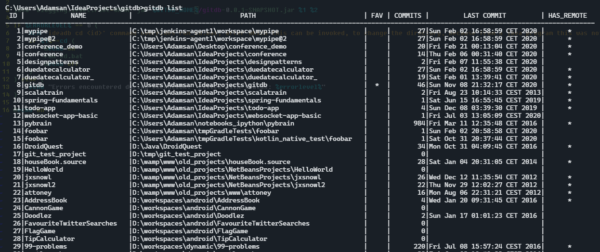
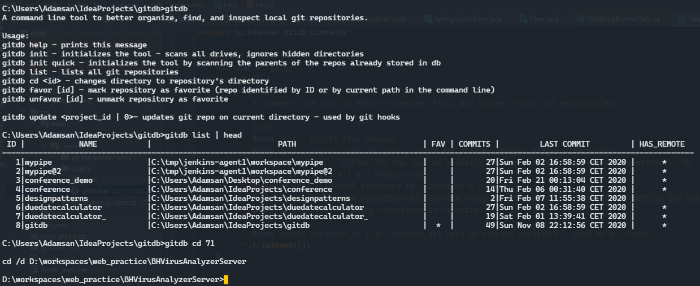

#  GITDB 

> A command line tool to better organize, find, and inspect local git repositories.

### What problem does it solve?

If you have a lot of repositories on your local machine _(work, tutorial, experiments, hobby projects, etc..)_, in different folders, drives,
it can be hard to keep track, where everything is.

GITDB solves this problem by keeping and maintaining a database about the local repositories.
Stores basic information in a sqlite database in `~/.gitdb/.repos.db`, and hooks into git commands (post-commit), and updates the state of repositories, when a commit happens.

You can find and list all the repositories on your machine, or your most recent ones, and `cd` into it.

> **⚠  WARNING: To users with custom git workflows/tools.**  
> If you are using customised git hooks (post-commit) in your workflow, or use tools, that rely on them,
> or on `global templatedir` this tool might be interfering with it!

### Commands:

| Command&nbsp;&nbsp;&nbsp;&nbsp;&nbsp;&nbsp;&nbsp;&nbsp;&nbsp;&nbsp;&nbsp;&nbsp;&nbsp;&nbsp;&nbsp;&nbsp;&nbsp;&nbsp;&nbsp; | Description |
| --- | --- | 
| `gitdb init` | creates database, starts scan on all drives for directories containing .git folder. Creates and configures global templatedir `git config --global init.templatedir ~/.git-db/.git-templates`. Adds a post-commit git hook to all repos with an update <id> call. All new or cloned projects will be tracked. |
| `gitdb init quick` | same as above, but it only searches in parents of existing git repos (in db), not in drives. For quick testing. | 
| `gitdb list` | lists .git repositories on your machine from it's database |
| `gitdb cd <id>` | change directory to repository identified by id (number / sha / project name). ⚠ In Linux this command needs to be called with `source` in order to effect current working directory. For example: `. gitdb cd 4` |
| `gitdb favor [id]` | mark repository (by id or by current dir) as favorite |
| `gitdb unfavor [id]` | unmark repository as favorite |
| `gitdb help` | prints help
| `gitdb update <id\|0>` | updates git repo in the current directory - used internally by git hooks

### Install and initialization

- #### From Release
    Java install not needed  
    (TODO: include jre to release bundle) Command used to create JRE: `jlink  --output custom_jre --add-modules java.sql,java.desktop,java.naming,jdk.unsupported`
    - extract zip to a folder, for example `D:\Java\gitdb`
    - set GITDB_HOME environment variable with value of the above folder, and add GITDB_HOME to PATH environment variable
  (Linux: `export GITDB_HOME=~/bin/gitdb`)
    - run `gitdb init` command, and confirm. It can take a long time, (~30 min)
- #### From Source
    Required java version: Java 11 or above
    - clone source code
    - set GITDB_HOME environment variable to an existing folder, `D:\Java\gitdb` and add GITDB_HOME to PATH environment variable
    - open up a console and run `gradlew buildAndCopyJar` - this will build the project and copy the jar, and startup scripts to GITDB_HOME
    - run `gitdb init` command, and confirm. It can take a long time, (~30 min) 

### Screenshots
 
 

### Similar projects

- https://github.com/MirkoLedda/git-summary
- https://github.com/lzakharov/gitls
